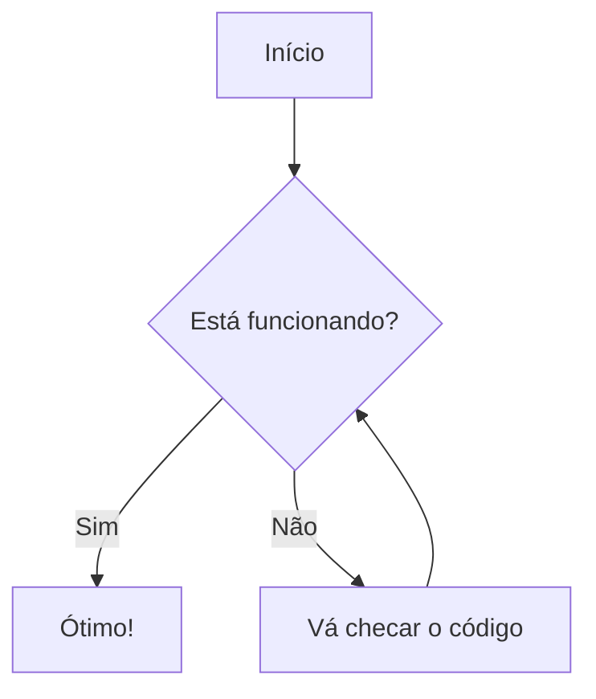

A arquitetura limpa nos traz uma proposta de design de código que a princípio parece complicada, principalmente. Praesent elementum facilisis leo vel fringilla est ullamcorper eget. At imperdiet dui accumsan sit amet nulla facilities morbi tempus. Praesent elementum facilisis leo vel fringilla. Congue mauris rhoncus aenean vel. Egestas sed tempus urna et pharetra pharetra massa massa ultricies.

Venenatis cras sed felis eget velit. *Consectetur* libero id faucibus nisl tincidunt. Gravida in fermentum et sollicitudin ac orci phasellus egestas tellus. Volutpat consequat mauris nunc congue nisi vitae. Id aliquet risus feugiat in ante metus dictum at tempor. Sed blandit libero volutpat sed cras. Sed odio morbi quis commodo odio aenean sed adipiscing. Velit 
```
**euismod in pellentesque massa placerat**. Mi bibendum neque egestas congue quisque egestas diam in arcu. Nisi lacus sed viverra tellus in
```
 Nibh cras pulvinar mattis nunc sed. Luctus accumsan tortor posuere ac ut consequat semper viverra. Fringilla ut morbi tincidunt augue interdum velit euismod.

***

## Camada de aplicação


__Tristique senectus et netus et malesuada fames ac turpis__. `Ridiculous mus mauris vitae ultricies `leo integer malesuada nunc vel. In mollis nunc sed id semper. Egestas tellus rutrum tellus pellentesque. Phasellus vestibulum lorem sed risus ultricies tristique nulla. Quis blandit turpis cursus in hac habitasse platea dictumst quisque. ***Eros donec ac odio tempor orci dapibus ultrices. Aliquam sem et tortor consequat id porta nibh. Adipiscing elit duis tristique sollicitudin nibh sit amet commodo nulla***. Diam vulputate ut pharetra sit amet. Ut tellus elementum sagittis vitae et leo. Arcu non odio euismod lacinia at quis risus sed vulputate.

1. Item 1
2. Item 2
3. Item 3
4. Item 4
5. Item 5
6. Item 6


